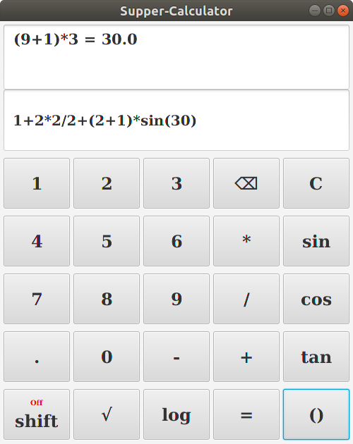
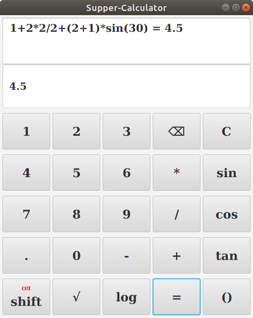
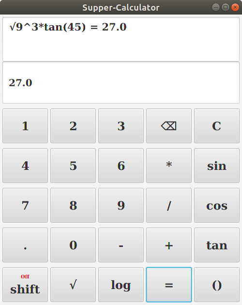
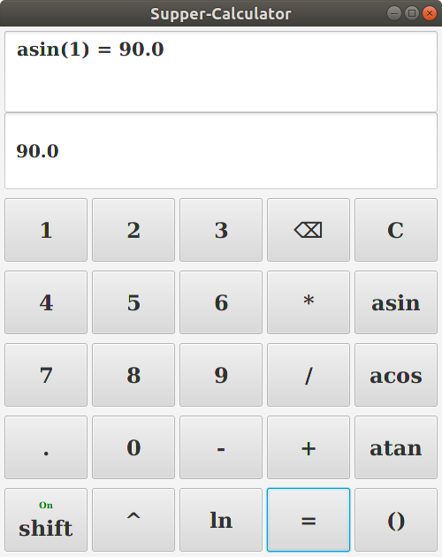
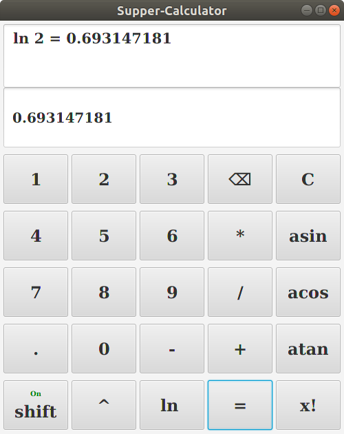
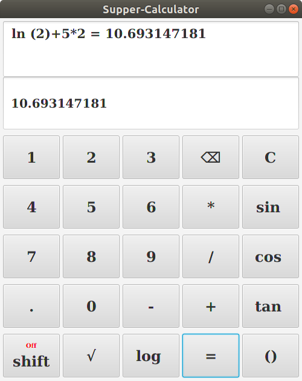

<h1>JFXSuper_calculator</h1>
    is a complete calculator programmed by JavaFX

<h1>Libraries_used</h1>
<h3>PME</h3>
    <a href="https://github.com/shoukreytom/PME_Release/raw/master/PME-release_v0.0.jar">Download</a>
    <a href="https://github.com/shoukreytom/PME">Source code</a>

<h2>Screenshots</h2>

